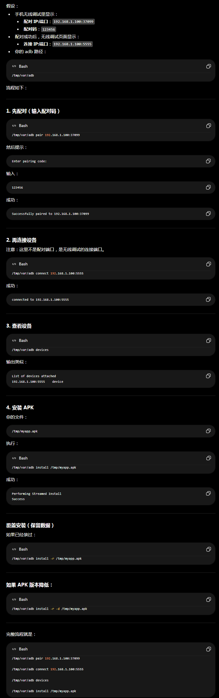

<div align="center">

# 🛠 ADB-Toolkit · MIPSEL 路由器 ADB 工具集

> **在 Padavan / 老毛子固件路由器上运行 ADB，轻松管理 Android 设备**

[](https://github.com/lmq8267/ADB)
[](#)
[](#)
[](#)

[📦 下载](#download) • [🚀 快速开始](#quickstart) • [🔧 构建](#build) • [📱 甲壳虫ADB](#bugjaeger)

</div>

---

## 📋 项目概述

某些手机系统会阻止安装高危软件（如 RustDesk 等远程控制应用），此时需要通过 ADB 进行安装。本项目为 **Padavan / 老毛子固件路由器** 提供开箱即用的 ADB 工具集：

| 组件 | 说明 |
|------|------|
| **`adb-mipsel`** | 静态编译的 MIPSEL 架构 ADB 二进制，可直接在路由器上运行 |
| **`adb-web`** | 轻量级 C 语言 Web 服务器，提供浏览器端 ADB 操作界面 |
| **`甲壳虫ADB助手.apk`** | Android 端 ADB 管理工具（解锁高级版），支持无线调试配对 |

---

## ✨ 功能特性

- ✅ **MIPSEL 架构适配** — 专为 Padavan / 老毛子 / OpenWrt 路由器编译，静态链接无依赖
- ✅ **无线调试（Android 11+）** — 支持 `adb pair` 配对连接，无需 USB 数据线
- ✅ **Web 可视化界面** — 浏览器中运行 ADB 命令、安装 APK、文件管理
- ✅ **免 Root 刷机** — 配合甲壳虫ADB助手可 OTG 连接其他设备执行 fastboot 命令
- ✅ **静态编译** — 使用 musl 工具链，单一二进制文件，即下即用
- ✅ **CI 自动构建** — GitHub Actions 在线交叉编译，持续更新

---

<a name="quickstart"></a>
## 🚀 快速开始

### 1️⃣ 在路由器上运行 ADB

```bash
# 下载 adb-mipsel 至路由器
wget https://github.com/lmq8267/ADB/releases/latest/download/adb-mipsel

# 赋予执行权限
chmod +x adb-mipsel

# 运行 ADB
./adb-mipsel devices

# 通过无线连接设备（需先在手机上开启 开发者选项 → 无线调试）
./adb-mipsel connect 192.168.1.100:5555
```

> 💡 完整 ADB 命令说明详见 [adb-1.0.31帮助信息.md](./adb-1.0.31帮助信息.md)

 

### 2️⃣ 使用 Web 界面

```bash
# 将 adb-web 和 adb-mipsel 放在同一目录
# 赋予执行权限
chmod +x adb-web adb-mipsel

# 启动 Web 服务（默认端口 9585）
./adb-web

# 浏览器访问
# http://路由器IP:9585
```


### 3️⃣ 通过无线调试配对（Android 11+）

<details>
<summary>📖 点击展开详细步骤</summary>

**前提条件：** 手机已开启「开发者选项」→「无线调试」

1. 在路由器上运行 `adb-mipsel` 或在 Web 界面操作
2. 甲壳虫ADB里点击右上角 **⋮（三点菜单）** → **配对设备**
3. 输入手机上显示的 **IP地址:端口** 和 **6位配对码**
4. 配对成功后，在终端/Web界面输入 `adb connect IP:端口`
5. 手机上点击「允许 USB 调试？」

> **注意：** `adb-mipsel.1.0.31` 版本**不支持**配对功能。如需配对请使用本仓库编译的最新版。
>
> 配对功能需要 ADB 1.0.41+，本仓库 CI 使用 [android-tools-static](https://github.com/meator/android-tools-static) 源码构建，完整支持 `adb pair`。

</details>

---

<a name="bugjaeger"></a>
## 📱 甲壳虫ADB 助手

本仓库附带 **[甲壳虫ADB助手 1.2.9 解锁高级版](./甲壳虫ADB_1.2.9-解锁高级版.apk)**，这是一款 Android 端强大的 ADB 管理工具。

### 核心功能

| 功能 | 说明 |
|------|------|
| 🔌 **USB / 无线连接** | 支持 OTG 数据线直连和 WiFi 无线调试 |
| 📲 **应用管理** | 安装、卸载、停用/启用应用，清除数据/缓存 |
| 📂 **文件管理** | 浏览、上传、下载、删除设备文件 |
| 🖥️ **远程控制** | scrcpy 投屏控制，实时操作设备屏幕 |
| ⚡ **Fastboot 命令** | 免 Root 执行 fastboot 刷机命令（需 OTG） |
| 🔑 **无线调试配对** | **完整支持 Android 11+ `adb pair` 配对机制** |

### 配对功能详解

经分析，甲壳虫ADB该版本**完全支持** Android 11+ 无线调试配对：

- 入口位于 **连接界面 → 右上角 ⋮ 菜单 → 配对设备**
- 支持输入 IP地址:端口 和 6位配对码
- 配对成功后自动发起 ADB 连接
- 无需解锁高级版即可使用配对功能

---

<a name="build"></a>
## 🔧 自行构建

### 构建 adb-web（本地）

```bash
# 依赖：gcc, make, xxd
make
```

### 交叉编译 adb-mipsel

使用 GitHub Actions 在线编译，详见 [build-mipsel.yml](./build-mipsel.yml)：

```yaml
# 使用 musl 交叉工具链
# 工具链: mipsel-linux-muslsf
# 源码: android-tools-static
# 优化: -static, -Os, UPX 压缩
```

也可手动触发：
1. 进入仓库 [Actions](https://github.com/lmq8267/ADB/actions) 页面
2. 选择 **"在线静态编译 adb (mipsel-muslsf)"**
3. 点击 **Run workflow**

---

## 📂 项目结构

```
├── adb-mipsel.1.0.31          # 预编译 MIPSEL ADB 1.0.31 版（不支持配对）
├── adb-web                    # 预编译 adb-web 服务端
├── adb-web.c                  # adb-web 源码（C语言）
├── index.html                 # Web 界面 HTML（嵌入 adb-web）
├── Makefile                   # 构建脚本
├── build-mipsel.yml           # MIPSEL 交叉编译 CI 配置
├── .github/workflows/         # GitHub Actions 工作流
│   └── GitHub在线编译mipsel-adb.yml
├── 甲壳虫ADB_1.2.9-解锁高级版.apk  # Android ADB 管理工具
├── adb-1.0.31帮助信息.md       # ADB 1.0.31 帮助文档
├── adb-1.0.41帮助信息.md       # ADB 1.0.41 帮助文档
├── adb使用示例.png             # 甲壳虫ADB 使用截图
├── adb使用示例.txt             # ADB 使用命令示例
└── adb-web界面.png             # Web 界面截图
```

---

<a name="download"></a>
## 📦 下载

| 文件 | 说明 | 链接 |
|------|------|------|
| `adb-mipsel` | MIPSEL 架构 ADB（最新版，支持配对） | [Actions 构建产物](https://github.com/lmq8267/ADB/actions) |
| `adb-mipsel.1.0.31` | ADB 1.0.31 经典版（不支持配对） | [📥 直接下载](./adb-mipsel.1.0.31) |
| `adb-web` | Web 界面服务端 | [📥 直接下载](./adb-web) |
| `甲壳虫ADB_1.2.9-解锁高级版.apk` | Android ADB 管理工具 | [📥 直接下载](./甲壳虫ADB_1.2.9-解锁高级版.apk) |

---

## ❓ 常见问题

<details>
<summary><b>Q: adb-mipsel 可以在哪些路由器上运行？</b></summary>
支持 MIPSEL 架构（小端序 MIPS）的 Padavan / 老毛子 / OpenWrt 固件路由器。
</details>

<details>
<summary><b>Q: 无线调试提示"配对失败"怎么办？</b></summary>
1. 确保手机和路由器在同一局域网<br>
2. 检查手机「开发者选项」→「无线调试」已开启<br>
3. 重新生成配对码<br>
4. 确保 ADB 版本 ≥ 1.0.41（旧版不支持配对）
</details>

<details>
<summary><b>Q: adb-web 默认端口是什么？如何修改？</b></summary>
默认端口为 <code>9585</code>。如需修改，请修改源码中的 <code>g_port</code> 变量后重新编译。
</details>

<details>
<summary><b>Q: 甲壳虫ADB 解锁高级版有什么额外功能？</b></summary>
- 免 Root 运行 fastboot 命令<br>
- 应用搜索功能<br>
- 解除同时连接 2 台设备的限制<br>
- 解除文件多选 5 项限制<br>
- 从本机已安装应用选择 APK 安装<br>
- 保存快捷命令
</details>

---

## 🙏 致谢

- [恩山无线论坛](https://www.right.com.cn/forum/) — Padavan 固件社区
- [meator/android-tools-static](https://github.com/meator/android-tools-static) — MIPSEL 交叉编译源码
- [didjdk](https://www.coolapk.com/) — 甲壳虫ADB助手开发者
- [musl-libc](https://musl.libc.org/) — 轻量级 C 标准库

---

<div align="center">

**⚠️ 声明**

本仓库仅用于学习和研究目的。甲壳虫ADB助手 APK 版权归原开发者所有。

---

⭐ 如果这个项目对你有帮助，请点个 Star！

[](https://github.com/lmq8267/ADB)

</div>
